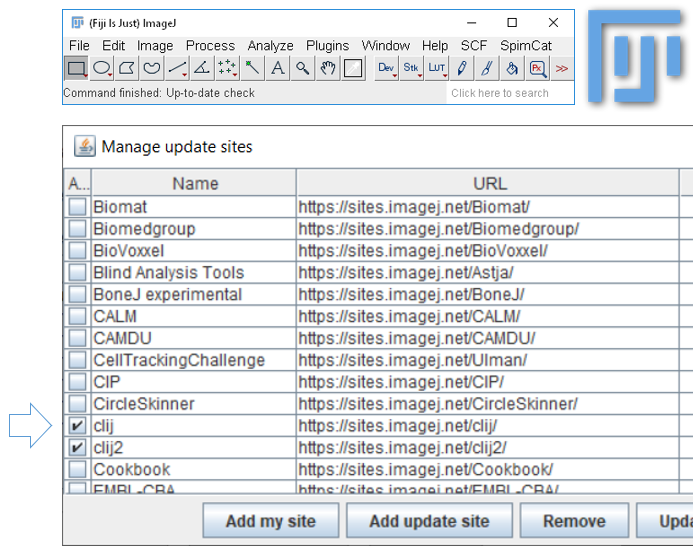

## Installation
[Download and install Fiji](https://fiji.sc/Downloads). Afterwards, click the menu `Help > Update...` and activate the CLIJ and CLIJ2 update sites.



After restarting Fiji, CLIJ is successfully installed, if you find a menu entry _Plugins > ImageJ on GPU (CLIJ2)_.

## Testing the installation
You can execute [this macro](https://github.com/clij/clij2-docs/blob/master/src/main/macro/benchmarking.ijm) to see if CLIJ and graphics card drivers are installed correctly. In case of issues, consult the [troubleshooting section](https://clij.github.io/clij-docs/troubleshooting) or contact us via [image.sc](https://image.sc).

## Windows and MacOS
On Windows and MacOS the installation should work right away in case the computer has a built-in Intel HD or AMD Ryzen GPU. In case dedicated AMD or NVidia GPUs are used, special drivers might have to be installed. Search for more information about drivers on the websites of the GPU vendors. 

## Windows: AMD and NVidia graphics cards
In case of processing large images and/or working with large kernels, errors may pop up when using NVidia or AMD graphics cards on Windows. The issue is related to a timeout of the operating system interrupting processing on the GPU. Add the following entries keys to the windows registry and restart the computer: 
```
[HKEY_LOCAL_MACHINE\SYSTEM\CurrentControlSet\Control\GraphicsDrivers]
"TdrDelay"=dword:0000003c
"TdrDdiDelay"=dword:0000003c
```
Be really careful when doing this. Don't do it, if you're not aware what that means. Ask you IT department for support. [Read the BSD3 license file](license.txt) for details on why we're not responsible for your actions on your computer. More technical background information: 

[https://docs.microsoft.com/en-us/windows-hardware/drivers/display/tdr-registry-keys](https://docs.microsoft.com/en-us/windows-hardware/drivers/display/tdr-registry-keys)

[https://community.amd.com/thread/180166](https://community.amd.com/thread/180166)

[https://support.microsoft.com/en-us/help/2665946/display-driver-stopped-responding-and-has-recovered-error-in-windows-7](https://support.microsoft.com/en-us/help/2665946/display-driver-stopped-responding-and-has-recovered-error-in-windows-7)

## Linux
Linux users need to install drivers for OpenCL, even on Intel HD GPUs. It is recommended to install the packages [beignet](https://github.com/intel/beignet) and [ocl-icd-devel](https://github.com/OCL-dev/ocl-icd).

[Back to CLIJ2 documentation](https://clij.github.io/clij2-docs)

[Imprint](https://clij.github.io/imprint)

